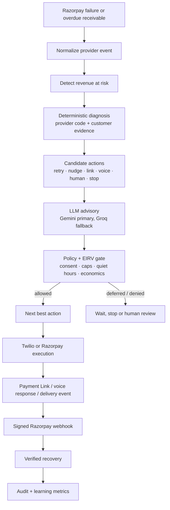
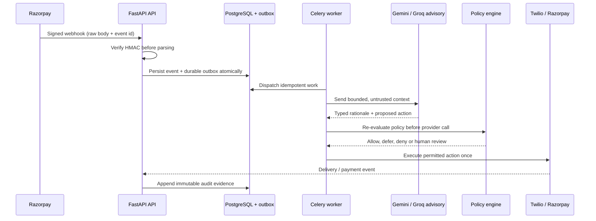
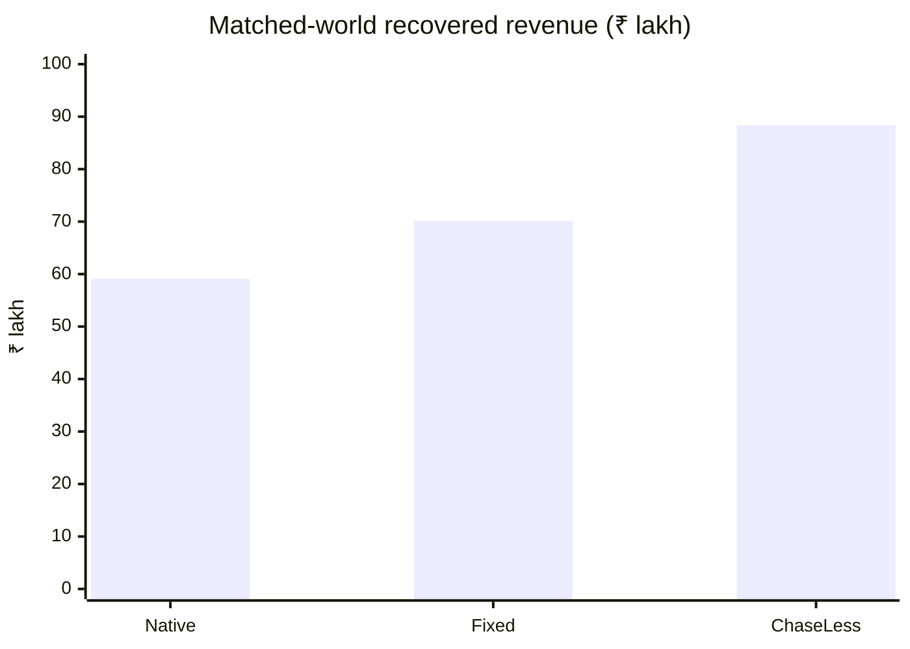

# ChaseLess — AI Revenue Recovery

**Razorpay Buildathon 2026 · Track 03 — AI Revenue Recovery**

ChaseLess is a policy-bounded revenue recovery control plane for failed subscriptions and overdue
B2B receivables. It converts a provider failure into a measured, explainable workflow:

> **Detect → Diagnose → Decide → Act → Verify → Learn**

The system identifies revenue at risk, selects the next best intervention, executes it through
consented provider channels, and counts revenue only after a trusted Razorpay event confirms
payment.

## Track alignment

The [official Track 03 brief](https://razorpay.com/buildathon/) asks builders to detect revenue at
risk, determine and execute a bounded recovery workflow, and show measured money recovered with
compliant escalation, stopping rules and an audit trail.

| Track 03 bar | ChaseLess implementation | Evidence |
|---|---|---|
| Detect revenue at risk | Razorpay webhook ingestion, subscription/invoice cases and Customer 360 | Recovery portfolio and case detail |
| Diagnose the cause | Deterministic taxonomy using provider failure codes and customer history | `backend/chaseless/domain/diagnosis.py` |
| Determine the intervention | EIRV scoring, contact fatigue, recovery budget and versioned policy | `scoring.py`, `policy.py` |
| Execute a bounded workflow | Idempotent action executor with Twilio channels and Razorpay Payment Links | `backend/chaseless/services/actions.py` |
| Compliant escalation and stopping | Consent, contact caps, quiet hours, opt-out, EIRV floors and human review | `backend/chaseless/domain/policy.py` |
| Measured recovery | Matched-world batch simulator and provider-correlated recovery facts | `evaluation/results/` |
| Audit trail | Append-only timeline with decision source, provider reference and policy version | `/evidence` and case timeline |

## System overview



### Trust boundary



The language model has no authority to mutate money, customer identity, payment URLs, policy,
budgets, opt-out state or idempotency keys. It proposes a bounded action; deterministic policy
retains authorization.

## End-to-end workflow

1. **Detect** — verify and normalize a Razorpay event into a recovery case.
2. **Diagnose** — classify `CARD_EXPIRED`, `INSUFFICIENT_FUNDS`, `BANK_DECLINED`, technical,
   mandate and overdue-invoice conditions using provider evidence and payment history.
3. **Decide** — score candidate interventions by expected incremental recovery value (EIRV),
   action cost, fatigue penalty and risk penalty. Gemini provides an explanation; Groq is a
   bounded fallback when Gemini is unavailable.
4. **Authorize** — apply consent, contact caps, quiet hours, opt-out, intervention limits,
   minimum EIRV and merchant policy. The selected policy version is persisted with the run.
5. **Act** — execute one idempotent action: native retry wait, personalized nudge, payment-method
   update, Razorpay Payment Link, consented Twilio voice call or human escalation.
6. **Capture intent** — voice responses are classified into `PAY_TODAY`, `PAY_ON_DATE`,
   `NEEDS_HELP`, `DECLINES_PAYMENT` or `UNKNOWN`; a promise-to-pay pauses duplicate contact.
7. **Verify** — correlate `payment_link.paid` or subscription-charged events. A sent message or
   spoken promise never marks money as recovered.
8. **Learn** — append outcome, provider reference, contact count and recovery amount for portfolio
   metrics and matched-world evaluation.

## Product surface

- **Recoveries** — prioritized revenue-at-risk portfolio with diagnosis, failure code, action state
  and customer history.
- **Case workspace** — Detect → Diagnose → Decision → Action → Response → Verified Recovery,
  including AI rationale, provider delivery state and Payment Link.
- **Customer 360** — masked contact endpoints, payment history, segment, tenure, contact budget
  and promise-to-pay state.
- **Proof** — immutable audit events, provider references and benchmark evidence.
- **Import** — Razorpay Test Mode event import with idempotency and signature validation.

## Evaluation evidence

The committed matched-world benchmark uses the same synthetic customers and outcome random variable
for native recovery, fixed dunning and ChaseLess adaptive allocation:

| Strategy | Recovered | Contacts | Policy violations |
|---|---:|---:|---:|
| Native recovery | ₹59.09 lakh | 0 | 0 |
| Fixed dunning | ₹70.14 lakh | 3,500 | 0 |
| ChaseLess | ₹88.35 lakh | 3,177 | 0 |

That is ₹18.22 lakh incremental recovery versus fixed dunning with 323 fewer contacts and zero
policy violations in the committed run. These are matched synthetic evaluation results, not a
promise of production uplift.



Regenerate the benchmark:

```bash
docker compose exec api python -m evaluation.run_benchmark --seed 20260901 --customers 10000
```

See [docs/EVALUATION.md](docs/EVALUATION.md) for metric definitions and reproducibility rules.

## Technology and reliability

- **Frontend:** Next.js 16, React 19, TypeScript and a server-side API proxy.
- **API:** FastAPI, Pydantic contracts, SQLAlchemy and PostgreSQL.
- **Orchestration:** explicit recovery graph, Celery worker and Redis queue.
- **Payments:** Razorpay Test Mode API, Payment Links and raw-body HMAC webhook verification.
- **AI:** Gemini bounded advisory, Groq fallback, guarded JSON schemas and deterministic fallback.
- **Outreach:** Twilio voice, SMS and WhatsApp adapters with consent and provider guardrails.
- **Integrity:** transactional outbox, event deduplication, idempotent execution, integer minor-unit
  money, masked contacts and append-only audit events.
- **Operations:** Docker Compose, health/readiness endpoints and structured logs.

## External technology integrations

| Integration | Responsibility in the recovery loop |
| --- | --- |
| **Razorpay Test Mode APIs** | Ingest payment/subscription failure signals, create test-mode Payment Links, and verify outcomes through signed webhook events. |
| **Google Gemini API** | Primary bounded reasoning layer for diagnosis, recovery-action selection, and reviewer-facing rationale. |
| **Groq API** | Fallback inference provider when Gemini is unavailable or returns an invalid response. |
| **Twilio APIs** | Consent-gated SMS, WhatsApp, and voice-agent delivery to the configured test recipient, including delivery status and callback events. |
| **Sarvam AI APIs** | Indian-language/Hinglish voice synthesis for the voice recovery experience and promise-to-pay interaction. |

All provider calls are isolated behind adapters. Provider output is treated as untrusted input and
must pass schema validation, policy authorization, consent checks, idempotency controls, and audit
logging before it can affect a recovery case.

## Run locally

Requirements: Docker Desktop, a Razorpay Test Mode account, and optional Gemini/Groq/Twilio
credentials for provider adapters.

```bash
copy .env.example .env
# Fill server-side credentials in .env; never commit .env.
docker compose up --build
docker compose exec api python -m scripts.seed_demo
```

Open [http://localhost:3000](http://localhost:3000). The root Refresh control reseeds the
controlled test portfolio with stable recipients and ten recovery scenarios. External
notifications are restricted to the configured test recipient.

For an HTTPS Razorpay webhook during local testing:

```text
https://<public-ngrok-host>/api/v1/webhooks/razorpay
```

## Verification commands

```bash
ruff check backend apps tests scripts evaluation
mypy backend apps/api apps/worker
pytest
cd apps/web && pnpm lint && pnpm build
```

## Repository guide

- [Architecture and trust boundaries](docs/ARCHITECTURE.md)
- [API and provider contracts](docs/API.md)
- [Track 03 submission and evidence map](docs/SUBMISSION.md)
- [Reproducible evaluation](docs/EVALUATION.md)
- [Razorpay Test Mode operations](docs/RAZORPAY_TEST_MODE.md)
- [Failure recovery log](docs/FAILURES.md)

## Security and data handling

Secrets live only in environment variables. `.env` is ignored; `.env.example` contains placeholders
only. Contact endpoints are encrypted at rest and masked in reviewer responses. No card numbers,
mandate credentials, API secrets or full payment instruments are stored in application data.
